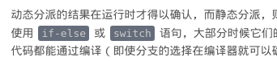

# photon-blog-theme
> A Leanote blog theme using photon.

Forked from gitforziio/photon-blog-theme, modifyed to fit my need.
[DEMO](http://gaunthan.leanote.com)

## Improvements

- 细微调整主题样式，修改段落和字体大小，使其可读性更高
- 设置代码高亮主题为Solarized-dark
- 修复了搜索问题
- 在页面右侧添加了导航栏，并与工具栏下拉按钮关联，支持文章导航
- 优化了页面左侧边栏：添加了个人链接栏
- 使用模板和js生成左边栏item，可直接修改 theme.json 文件添加新的item
- 规范了脚注的显示，将其作为右上标显示
- 美化了导航栏，修改修饰符
- 将标题栏组建的显示内容替换为英文

## Screenshots
### Homepage

### Navigatiton Bar

### Left Side Bar

### Article

### Code

 

### Searching

### Mobile Port

