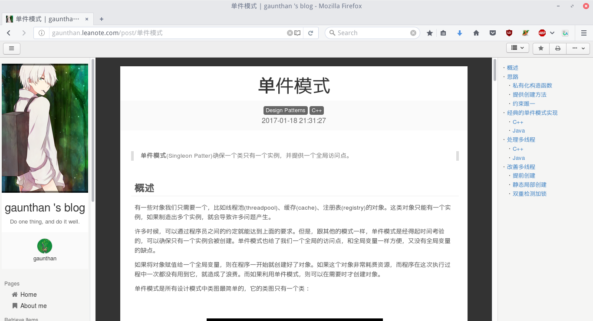
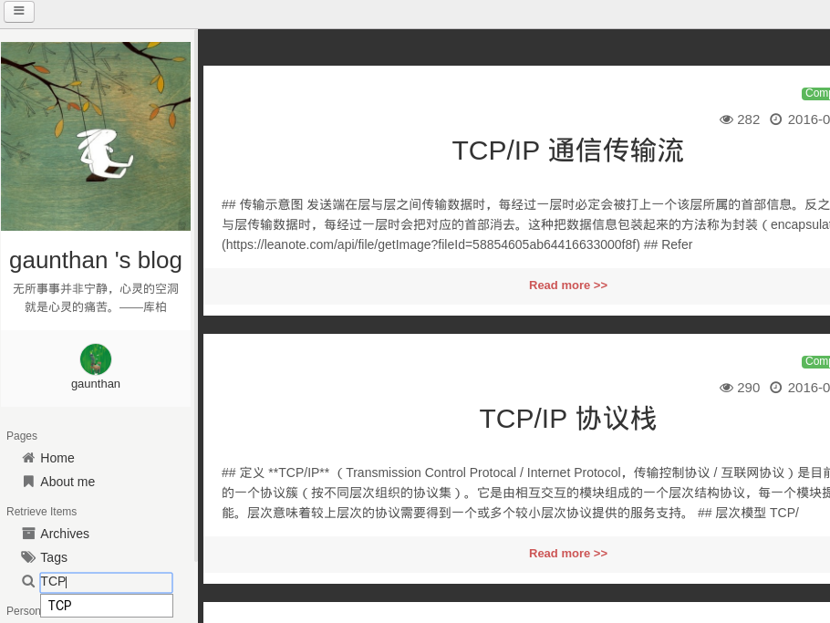
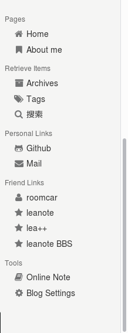
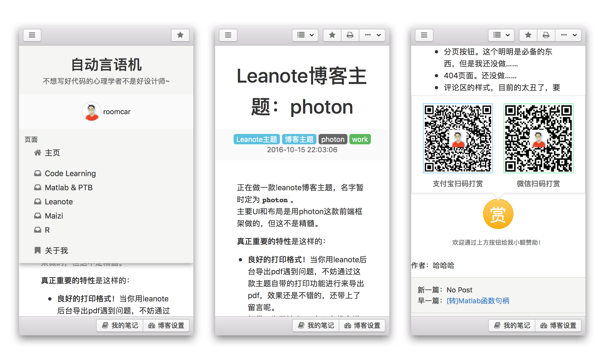
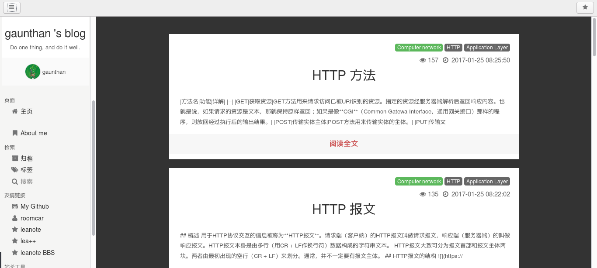
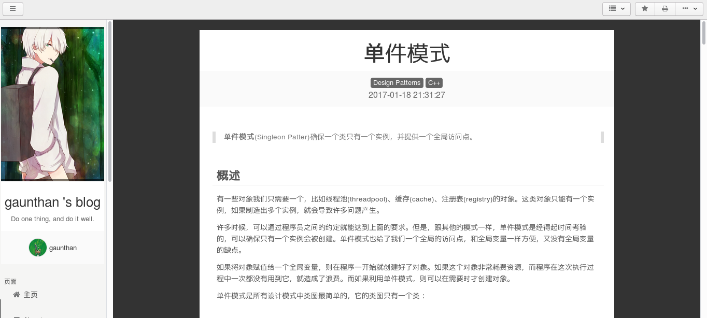
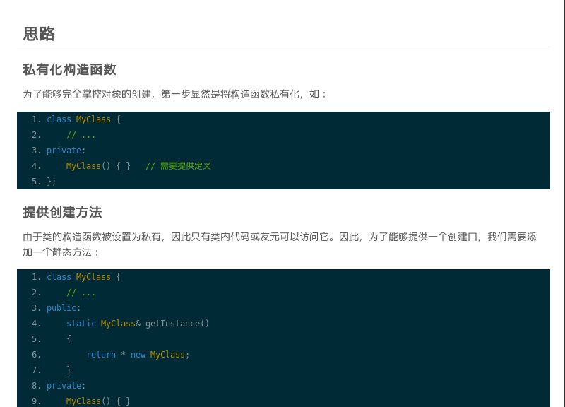

# photon-blog-theme
> A Leanote blog theme using photon.

Forked from gitforziio/photon-blog-theme, modifyed to fit my need.
[DEMO](http://gaunthan.leanote.com)

## 说明V3
规范了脚注的显示，美化了导航栏修饰符，将控件的显示内容替换为英文。

## 说明V2
### 本版本进度
- 修复了搜索问题。
- 在页面右侧添加了导航栏，并与工具栏下拉按钮关联。同时支持了文章导航功能。
- 优化了页面左侧边栏：添加了个人链接栏、使用模板生成item。

### 最新截图
#### 导航

#### 搜索

#### 左边栏

## 说明V1
按照个人爱好进行了修改，包括：

- 个人信息：个人链接、二维码等。
- 外观：代码渲染效果、段落对齐、字体等。

## 说明V0
由于原作者roomcar大大弃坑，部分功能暂未完成：文章导航、Firefox下的搜索功能等。
待完善下列功能：

- 文章导航功能
- 搜索服务兼容完善

## 截图
### 原效果

### 修改后效果
#### 主页

#### 文章

#### 代码效果
代码主题是Solarized-dark：

